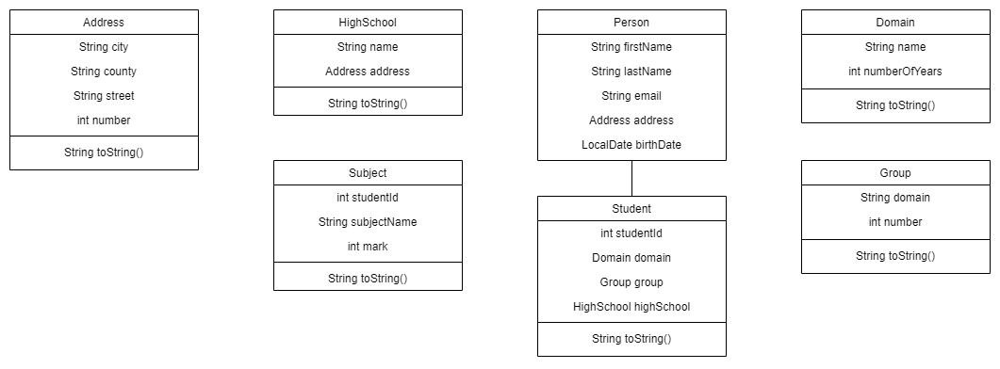

# Student Management Systems

## ETAPA 1

**Tema proiectului**: implementarea unui sistem de gestiune al studentilor dintr-o facultate, vizualizarea datelor despre acestia cum ar fi: materiile si notele acestora, grupa si domeniul de studiu, liceul de unde provin si altele. Modelul va cuprinde următoarele clase: 

- **clasa Address**: clasa pentru reprezentarea unei adrese a liceului sau pentru locul nasterii unei persoane
- **clasa Person**: clasa din care mosteneste clasa Student
- **clasa Student**: clasa ce pastreaza datele despre studenti
- **clasa HighSchool**: clasa ce cuprinde informatii despre liceul absolvit de student
- **clasa Subject**: clasa pentru reprezentarea materiilor si notelor unei student
- **clasa Domain**: clasa pentru clasificarea studentilor din functie de domeniul de studiu
- **clasa Group**: clasa pentru repartizarea studentilor in formatiuni de studiu



Pe langa acestea programul mai cuprinde si clasele:
- **clasa Service**: cuprinde toate functiile utile pentru realizarea comenzilor din meniu
- **clasa Menu**: implementeaza un meniu interactiv cu desgin pattern de tip singleton
- **clasa Main**: instantiaza un meniu si ruleaza programul principal al aplicatiei

### *Meniul interactiv al aplicatiei:*
```[python]
-----------------------------------
Choose an action.
1: Add new subject
2: Print all subjects
3: Add new domain
4: Print all domains
5: Add new group
6: Print all groups
7: Add new high school
8: Print all high schools
9: Add new student
10: Print all students
11: Print students sorted
0: Exit
-----------------------------------
```

## ETAPA 2

Adaugarea clasei **ReadWrite** pentru creare de fisiere CSV corespunzatoare claselor **Subject**, **Domain**, **Group** si **HighSchool** din care se citesc si in care se scriu date. Aceste fisiere sunt incarcate in program la inceputul acestuia iar datele introduse din meniul interactiv vor fi salvate permanent in aceste fisiere. Fisiere CSV au pe prima linie un header ce reprezinta metadate iar pe urmatoarele linii valori corespunzatoare obiectelor create.

### Exemplu fisier pentru clasa **Domain**:

```[python]
name,years
Informatica,3
Matematica,3
Istorie,3
Biologie,3
Automatica,4
Litere,4
Energetica,4
```

### Exemplu de afisare pentru clasa **Domain**:

```[python]
-----------------------------------
4
Domain: Informatica, Number of years: 3
Domain: Matematica, Number of years: 3
Domain: Istorie, Number of years: 3
Domain: Biologie, Number of years: 3
Domain: Automatica, Number of years: 4
Domain: Litere, Number of years: 4
-----------------------------------
```

## ETAPA 3

Configurarea unei baze de date cu JDBC si MySQL cu tabele corespunzatoare claselor **Domain**, **Group**, **Highschool**, **Subject** si **Student**. Pentru introducerea si modificarea datelor din tabele au fost create 5 clase de tip repository si singleton ce se conecteaza la baza de date.

Tabela **Student** poate fi modificata folosind toate cele 4 operatii CRUD: create, read, update si delete. Toate operatiile din meniu au fost modificate pentru a persista datele atat in fisierele CSV, cat si in tabelele bazei de date. In meniu au fost adaugate urmatoarele functionalitati:

```[python]
-----------------------------------
12: Print student by a given id
13: Update student name by a given id
14: Delete student by a given id
0: Exit
-----------------------------------
```

### Serviciu de audit

Pentru inregistrarea tuturor actiunilor facute intr-o rulare a programului am implementant o clasa de tip singleton ce scrie toate operatiunile desfasurate intr-un fisier de tip CSV cu formatul **nume_actiune, timestamp**. Un exemplu de astfel de fisier:


```[python]
-----------------------------------
configure tables,2022-05-26 16:36:08
load data,2022-05-26 16:36:08
add subject,2022-05-26 16:36:17
print subjects,2022-05-26 16:36:25
print domains,2022-05-26 16:36:28
close connection with database,2022-05-26 16:36:37
-----------------------------------
```
